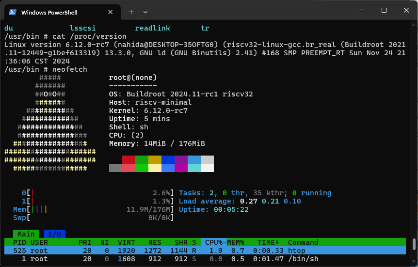
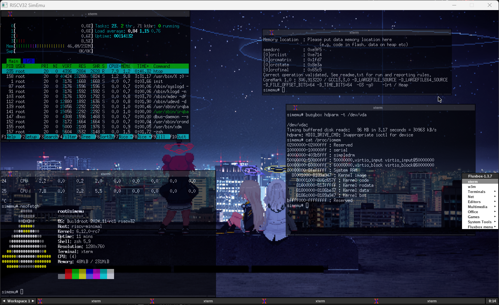
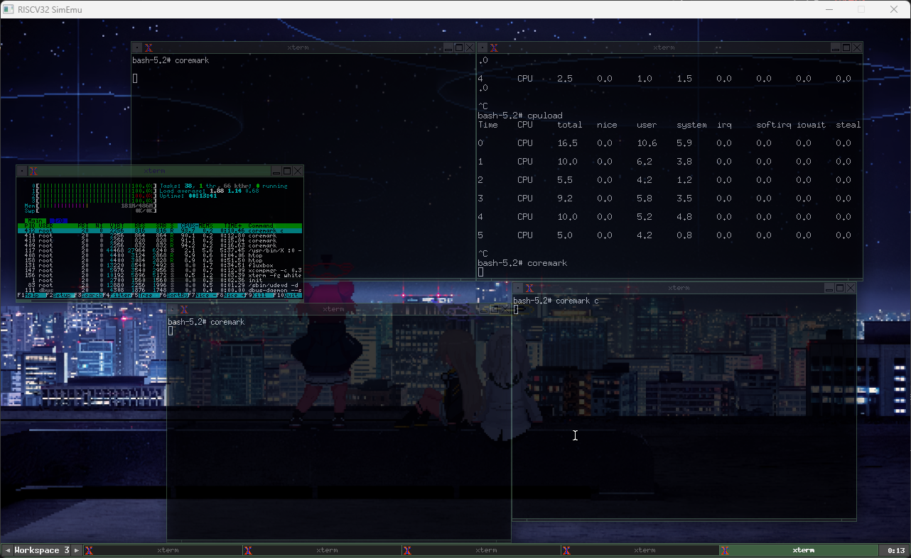
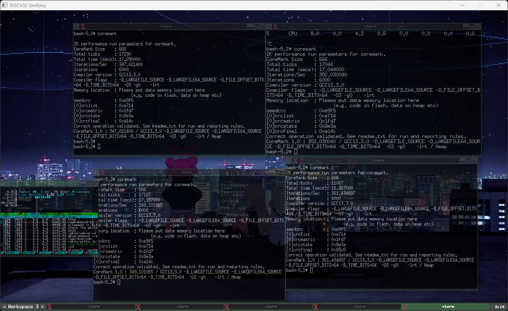

# riscv32-simemu
 A simple minimal riscv32imac virtual machine, support Linux MMU+SMP booting.





 - [x] RV32I Basic integer instruction
 - [x] RV32A atomic-instruction extension
 - [x] RV32M integer multiplication
 - [x] RV32C compressed instruction-set extension
 - [x] 8250 UART
 - [x] SV32 MMU
 - [x] SMP multithreading cpu/harts simulating supported
 - [x] virtio input keyboard and mouse
 - [x] virtio block disk
 - [x] simple framebuffer display
 

```
├─config     # kernel and buildroot config
├─firmware   # opensbi boot firmware
├─simemu     # emulator src
└─prebuild   # prebuild sbi firmware and linux image, 
               initramfs with buildroot contained.
```

SMP multi-process coremark test:




